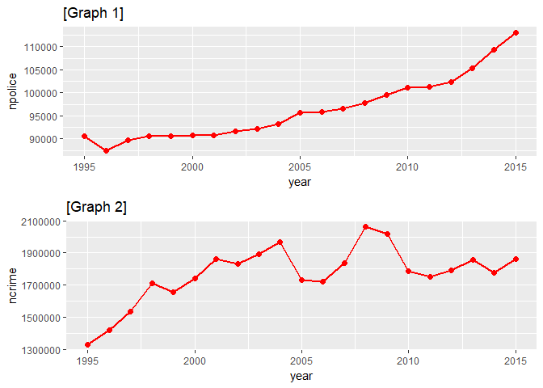
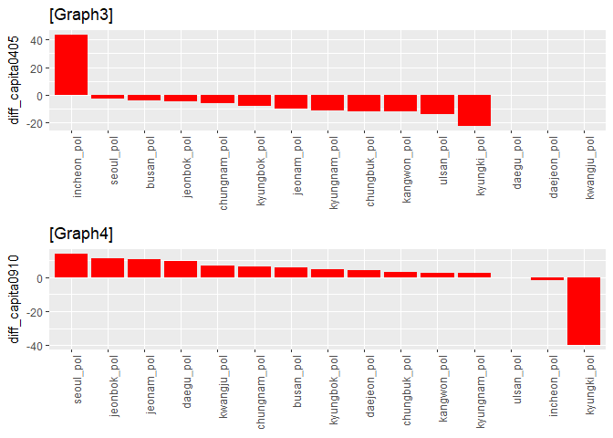
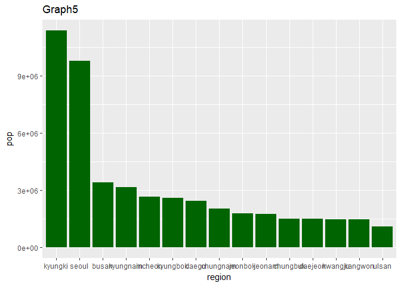
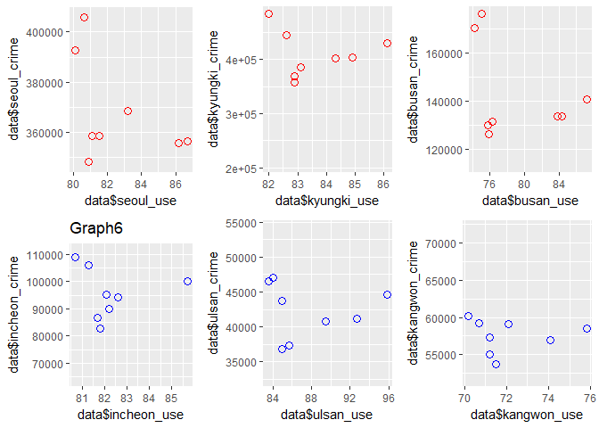
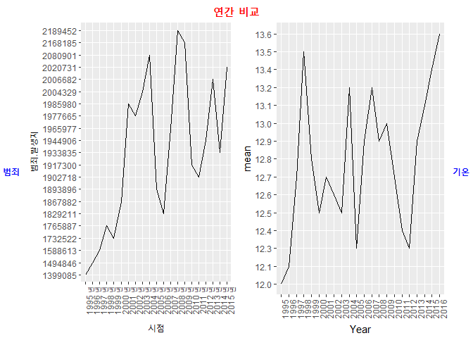
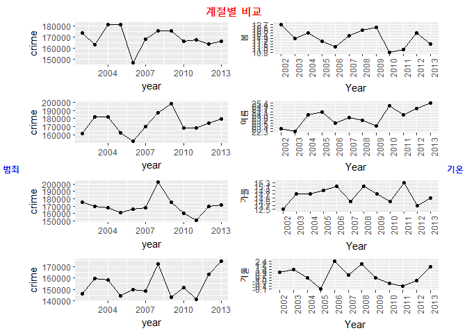
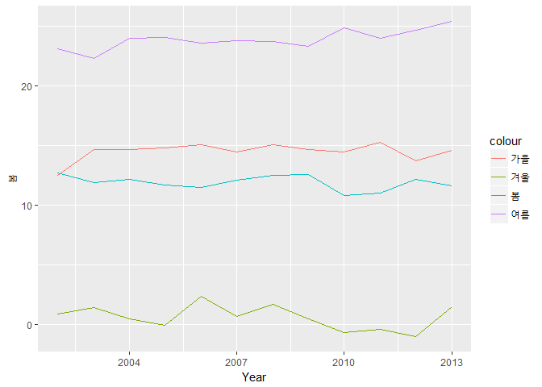
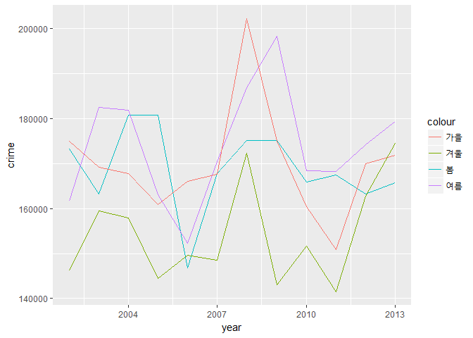

GROUP2\_report
================

``` r
library(grid)
library(gridExtra)
library(dplyr)
```

    ## 
    ## Attaching package: 'dplyr'

    ## The following object is masked from 'package:gridExtra':
    ## 
    ##     combine

    ## The following objects are masked from 'package:stats':
    ## 
    ##     filter, lag

    ## The following objects are masked from 'package:base':
    ## 
    ##     intersect, setdiff, setequal, union

``` r
library(ggplot2)
library(Rmisc)
```

    ## Loading required package: lattice

    ## Loading required package: plyr

    ## -------------------------------------------------------------------------

    ## You have loaded plyr after dplyr - this is likely to cause problems.
    ## If you need functions from both plyr and dplyr, please load plyr first, then dplyr:
    ## library(plyr); library(dplyr)

    ## -------------------------------------------------------------------------

    ## 
    ## Attaching package: 'plyr'

    ## The following objects are masked from 'package:dplyr':
    ## 
    ##     arrange, count, desc, failwith, id, mutate, rename, summarise,
    ##     summarize

``` r
library(readxl)
library(ggpubr)
```

    ## Loading required package: magrittr

``` r
data <- read.csv("C:/r_proj/report/data_for_report/crime_data.csv")
data2 <- read.csv("C:/r_proj/report/data_for_report/region_pop.csv")
crime <- read.csv("C:/r_proj/report/data_for_report/범죄 지역.csv")

crime <- crime %>%
  filter(범죄별 == "범죄발생 총건수(A)[건]", 발생지별 == "합계" ) %>%
  select(시점, 범죄.발생지)
```

-경찰력의 효율성을 중심으로-
============================

초록
====

이 연구의 목적은 '범죄율 하락에 실질적으로 기여하는 것은 무엇인가'에 대한 답을 찾는 것이다. 연구에 사용된 자료는 국가통계포털에 공개된 지역별 센서스 자료와 경찰청 통계연보 자료이다. 실증분석자료는 전국을 서울특별시 및 6개의 광역시, 그리고 전국 七道(제주도를 제외한)를 표본으로 1995~2015년 통계자료를 통합하여 구축됐다. 또한 통제된 지역별로 범죄발생 수, 하급 경찰서의 인력을 데이터로 사용했다. 이러한 데이터를 바탕으로, 서론에서 제시하게 될 ‘이례적 현상’이 일어나는 시점에서 횡단면 분석 및 시계열 분석을 시행했다. 서론\[분석\]에서는 매년 범죄의 수가 증가하는 추세를 제시하여 과연 경찰력의 물적 확대가 범죄율 경감에 기여하고 있는지에 대한 문제를 제기할 것이다. 본론\[분석\]에서는 특정 지역에서 연쇄살인사건이 발생한 뒤에 범죄자가 검거된 이후에도 범죄 발생지에 과한 경찰 인력 배치가 이뤄져 경찰 인력이 비효율적으로 사용되고 있음을 확인할 것이다. 또한 경찰력에 의한 범죄의 예방 효과를 검증하고 인터넷 이용율의 증가가 범죄 예방에 어떠한 영향을 미치는지 논할 것이다. 마지막으로 연평균 기온의 변화가 따라 범죄에 어떠한 영향미치는지 분석해보고 여름에 기온이 높을수록, 겨울에 기온이 낮을수록 범죄의 수가 감소했음을 확인할 것이다.

1. 분석주제\[서론\]
===================

우리는 어떤 범죄 또는 사고가 발생할 경우 정책 결정자들이 단순한 물적 확대, 예컨대 경찰관 숫자를 증가시키는 것으로 대처하는 것을 목격해왔다. 그러나 과연 이러한 대응이 궁극적으로 범죄율을 경감하는데 유효한지에 관해서는 의문이 제기될 수 있다. 경찰 투입 인력의 증가가 범죄율의 하락에 기여한다는 것은 자연스러운 추측이다. 그러나 실제로 데이터를 분석한 결과 지역별 경찰관 숫자와 범죄율 사이에는 양의 상관관계가 있었다(graph1&graph2). 그 이유로 크게 두 가지를 생각해 볼 수 있다. 첫째, 경찰인력이 효율적으로 사용되지 못했기 때문일 수 있다. 경찰력이 효율적으로 이용되지 못한다면 단순한 경찰력의 물적 확대는 범죄율 경감에 기여하지 못할 것이다. 두 번째 문제는 경찰관 숫자와 범죄율 사이의 내생성(endogeneity)이다. 예컨대 범죄의 증가가 단순한 트랜드이고, 경찰 인력의 증대가 범죄 증가에 따른 추종의 결과라면 위와 같은 결과가 나타날 수 있다. 이러한 이유로 단순한 통계자료만으로는 경찰 투입 인력이 범죄율 경감에 미치는 영향을 적절하게 평가하기는 어렵다. 그러나 본 연구에서는 2005년과 2010년에 전국적으로 나타나는 이례적 범죄율 하락을 목격할 수 있다. 특히 전 국민을 공포로 몰아넣었던 ‘김영철 연쇄살인 사건과 ‘강호순 연쇄살인 사건’이 앞에서 언급한 범죄율 하락과 어떠한 연관이 있는지 관찰하고, 지역별 인터넷 이용률, 기온변화가 범죄에 미치는 영향을 분석하여 범죄율 하락에 실질적으로 기여한 요인이 무엇인지 분석할 것이다.

2. 분석 데이터
==============

-데이터 소개

구축된 데이터는 통계청, 경찰청 통계연보에서 공개된 지역별 센서스 자료와 범죄 및 경찰인력 통계이다. 세부 내용으로는 지역별 1인당 순소비, 지역별 경찰인력 수, 지역별 범죄발생 수, 지역별 인터넷 이용률, 전국 범죄 발생률, 전국 경찰인력 수, 검거율이다. 또한 날씨가 범죄와 연관이 있는지 알아보기 위해 연 평균 기온, 계절별 평균 기온, 연간 범죄 발생, 월간 범죄 발생 데이터를 이용했다.

-데이터 선정 이유

지역별 소득 규모가 경찰 인력 배치에 영향을 주는지 알아보기 위해 1인당 순소비 데이터를 구축했다. 1인당 순소득이 아닌 순소비를 이용한 이유는 지역, 연도별 순소득 데이터가 존재하지 않았기 때문이다. 그러나 1인당 순소비는 1인당 순소득 자료를 대체하는 데 있어서 큰 무리가 없을 것으로 판단된다. 경찰인력과 범죄수를 지역별로 통제한 이유는 범죄가 지역별 문화적, 경제적 특성에 따라 영향을 받기 때문이다. 연간 기온의 변화 이외에도 계절간의 기온 차이가 계절간 범죄 건수에 영향을 미칠 것이라 판단하여 통계청이 제시한 기준에 따라 데이터를 봄(3월~5월), 여름(6월~8월), 가을(9월~11월), 겨울(12월~다음해 2월)로 구분지었다. 마지막으로 급증하는 SNS(social\_network\_system) 이용에 따라 범죄에 관한 경각심, 대중의 관심도가 높아지고 있다. 본 연구에서는 그러한 대중의 관심의 척도로서 '지역별 인터넷 이용률'데이터를 대리변수로 사용하였다.

3. 분석\[본론\]
===============

\[graph 2\]을 보면 2005년과 2010년에 범죄발생건수가 급격히 떨어지는 모습을 관찰할 수 있다.

``` r
p1=ggplot(data, aes(x= year,y=npolice)) + geom_line(col='red',size=1) + geom_point(col = 'red',size=2) +
  ggtitle('[Graph 1]')
p2=ggplot(data, aes(x= year, y= ncrime)) + geom_line(col='red',size=1) + geom_point(col = 'red',size=2) +
  ggtitle('[Graph 2]')

layout=matrix(c(1,1,2,2), nrow=2, byrow=TRUE)
multiplot(p1, p2, layout = layout)
```



``` r
#코드해석 : ggplot을 이용하여 각 그림을 변수 p1,p2에 할당하고, multiplot 함수를 이용해 2 by 1 의 형태로 그림을 한 화면에 출력했다. 
```

이러한 2005년과 2010년의 ‘이례적 범죄율 하락’에 주목한하면 경찰력 이외의 다른 변수가 범죄율 하락에 매우 큰 기여를 했을 가능성을 염두해볼 수 있다. 그러나 보다 정확한 분석을 위해서는 경찰인력과 범죄수를 지역별로 통제해줘야 한다. 그 이유는 경찰 인력의 배치는 전 지구적으로, 그리고 각 지역적 특성을 반영하여 이뤄지기 때문이다. 예컨대, 인구가 많은 서울 경기 지역에서는 범죄의 수와 경찰 인구의 절대량이 상대적으로 클 수 밖에 없다. 따라서 위에서 언급했던 이례적인 하락 구간에서의 2004,2005년과 2009,2010년의 데이터를 사용하여 ‘지역별 인구/지역별 경찰관수 = 경찰 1인당 담당인구’, ‘지역별 범죄수/지역별 인구= 범죄발생비율’를 구해 비교해보았다.

``` r
p_capita_04<- data2$pop/data[10,36:50]
p_capita_05<- data2$pop/data[11,36:50]
diff0405 <- p_capita_05 - p_capita_04
diff0405 <- as.data.frame(diff0405)
diff0405 = t(diff0405)
df = data.frame(rownames(diff0405),diff0405)
colnames(df) = c('region','diff_capita0405')
rownames(df) = c(1:15)
# 경찰 1인담 담당인구를 p_capita_XX 변수에 담았다. 그리고 이를 빼주어 전년 대비 1인당 담당 인구 변화를 구하였다.
p1= ggplot(df, aes(x=reorder(region,-diff_capita0405), y= diff_capita0405)) + geom_bar(stat= 'identity', fill='red') +
   ggtitle('[Graph3]') +
  theme(axis.text.x=element_text(angle=90, hjust=1),axis.title.x = element_blank())
# 앞에서 구한 차이를 지역별 내림차순으로 정렬한 막대그래프. 내림차순 정렬은 reorder 함수를 이용하였다. 이하에서도 같은 원리가 적용된다.
p_capita_09<- data2$pop/data[15,36:50]
p_capita_10<- data2$pop/data[16,36:50]
diff0910 <- p_capita_10 - p_capita_09
diff0910 <- as.data.frame(diff0910)
diff0910 = t(diff0910)
df2 = data.frame(rownames(diff0910),diff0910)
colnames(df2) = c('region','diff_capita0910')
rownames(df2) = c(1:15)

p2=ggplot(df2, aes(x=reorder(region,-diff_capita0910), y= diff_capita0910)) + geom_bar(stat= 'identity', fill='red') +
  ggtitle('[Graph4]') +
  theme(axis.text.x=element_text(angle=90, hjust=1),axis.title.x = element_blank())

layout=matrix(c(1,1,2,2), nrow=2, byrow=TRUE)
multiplot(p1, p2, layout = layout)
```



y축은 t년도에서 t-1년도의 1인당 담당인구를 빼준 1인당 담당인구의 변화량을 나타낸다. y의 값이 -(negative)가 됐다는 것은 과거에 비해 담당해야할 인구의 수가 줄었다는 것을 의미한다. 유영철이 검거된 해의 2004년과 2005년을 비교했을 때 인천 지역을 제외한 모든 지역에서는 1인당 담당인구가 줄어들었음을 확인할 수 있다.

반면 강호순이 검거된 해의 2009년과 2010년을 비교했을 때 경기 지역을 제외한 모든 지역의 1인당 담당인구가 증가했으며 그 수치 또한 상당하다. 2009년 강호순이 검거된 곳이 경기지역임을 감안했을 때 상당한 경찰 인력이 이 지역으로 편중되었음을 보여주는 자료이다. 범죄가 특지 지역에서 랜덤하게 발생한다고 가정했을 때, 이러한 사후적 인력 재배치는 범죄율 경감에 기여하지 못할 것으로 예상된다. 우리는 지금까지 범죄자의 범행에 초점을 두고 경찰력 증대에 따른 범죄 예방 효과를 관찰해왔다. 그러나 같은 원리로 잠재적 피해자의 감소 또한 범죄율을 감소시 수 있다. 말하자면 잠재적 피해자의 범행 피해에 대한 예방, 주의, 관심이 범죄율감 감소시킬 수 있다는 것이다. 본 연구에서는 그러한 척도의 대리변수로서 지역별 인터넷 이용률을 이용하였다. 지역별 인터넷 이용률과 범죄 발생의 관계를 분석하기에 앞서, 우리는 지역별 인구 분포를 고려해야 할 것이다\[Graph5\]. 왜냐하면 인구가 많이 밀집된 지역일수록 SNS, 언론 매체의 노출 등 'network effect'가 클 것으로 예상되기 때문이다.

``` r
data2 %>%
  select(pop,region) %>%
  ggplot(aes(x = reorder(region, -pop), y= pop)) + geom_bar(stat="identity",fill="darkgreen") +
  ggtitle('Graph5') + xlab('region')
```



``` r
# 지역별 인구를 내림차순으로 정렬한 막대그래프
```

분석의 편의를 위해 인구가 가장 많은 지역부터 경기, 서울, 부산, 그리고 인구가 가장 적은 지역부터 울산, 강원, 광주, 6개의 지역의 지역별 인터넷 이용률과 범죄 발생 비율의 관계를 살펴보았다\[Graph6\].

``` r
p1=ggplot(data,aes(x= data$seoul_use, y= data$seoul_crime)) + geom_point(shape=1, col='red',size=3)#
p2=ggplot(data,aes(x= data$incheon_use, y= data$incheon_crime)) + geom_point(shape=1, col='blue',size=3) +
  ggtitle('Graph6')
p3=ggplot(data,aes(x= data$kyungki_use, y= data$kyungki_crime)) + geom_point(shape=1, col='red',size=3)
p4=ggplot(data,aes(x= data$busan_use, y= data$busan_crime)) + geom_point(shape=1, col='red',size=3) #
p5=ggplot(data,aes(x= data$ulsan_use, y= data$ulsan_crime)) + geom_point(shape=1, col='blue',size=3) #
p6=ggplot(data,aes(x= data$kangwon_use, y= data$kangwon_crime)) + geom_point(shape=1, col='blue',size=3) # 6개 지역의 인터넷 이용률 대비 범죄수를 나타내는 점그래프를 p1~p6의 변수담 담았다.

vplayout <- function(x, y) viewport(layout.pos.row = x, layout.pos.col = y)
grid.newpage()
pushViewport(viewport(layout = grid.layout(2, 3)))
print(p1, vp = vplayout(1, 1))
print(p3, vp = vplayout(1, 2))
print(p4, vp = vplayout(1, 3))
print(p2, vp = vplayout(2, 1))
print(p5, vp = vplayout(2, 2))
print(p6, vp = vplayout(2, 3))
```



``` r
# 3  by 2 형태로 그림을 나타내기 위해 vplayout 함수를 정의해주고, grid.newpage(),pushViewport 함수를 이용해 다중그림출력 창을 연 뒤에, 앞에서 정의한 vpayout함수에 row,column을 각각 할당해주어 그림을 출력했다.
```

분석 결과 인구가 많은 지역에서 인터넷 이용률이 높을수록 범죄건수가 감소하는 경향을 보였다. 반면 인구가 적은 지역일수록 인터넷 이용률과 범죄율에는 사이에는 상관관계가 없거나 심지어 증가하는 패턴을 보였다. 이는 앞서 언급했던 시민들 간의 네트워크 효과로부터 기인할 결과라고 생각해볼 수 있다.

``` r
total_crime <- ggplot(data = crime, aes(x = 시점, y = 범죄.발생지, group = 1)) + 
  geom_line() + theme(axis.text.x = element_text(angle = 90, hjust = 1))

#연 평균 기온
tem_season <- read_excel("C:/r_proj/report/data_for_report/계절별 기온 평균.xls")
colnames(tem_season)[1] <- 'Year'
colnames(tem_season)[2] <- 'mean'

total_temperature <- ggplot(data = tem_season, aes(x = Year, y = mean, group = 1)) +
  geom_line() +
  theme(axis.text.x = element_text(angle = 90, hjust = 1))

#연 평균 기온과 연간 범죄 발생 건수 비교
figure <- ggarrange(total_crime, total_temperature,   
                    ncol = 2, nrow=1)
annotate_figure(figure, 
                top = text_grob("연간 비교", color = "red", face = "bold", size = 15),
                left = text_grob("범죄",  color = "Blue", face = "bold"), 
                right = text_grob("기온", color = "Blue", face = "bold"))
```



범죄 발생 그래프에서 05년과 10년에 급격하게 범죄 발생 건수가 하락한 것과 유사하게 연간 평균 기온 그래프에서도 05년과 10년에는 평년보다 기온이 낮게 나타났다. 두 그래프에서 나타나는 깊은 하락 구간을 주목하면, 두 그래프가 매우 유사한 패턴을 보이고 있음을 확인할 수 있다. 평균 기온이 하락하는 구간은 쉽게 말해, 여름에 덜 덥고 겨울에 더 춥다고 생각할 수 있다. 그러나 이는 평균의 함정을 유발 할 수 있으며, 실제로 그런 추측이 맞는지 확인하기 위해 4계절을 나누어 분석했다.

계절별 비교
===========

``` r
#계절별 범죄 데이터가 02년~13년으로 되어 있기 때문에 기준에 맞춰 기온 데이터 추출
tem_s <- tem_season %>% filter(Year >= 2002 & Year <= 2013) 

#월별 범죄 건수 
s <- read.csv("C:/r_proj/report/data_for_report/월별 범죄 건수.csv")
s <- s %>% filter(범죄별 == "합계")
##봄 범죄 건수 
spring <- data.frame(year = c(2002:2013),
                       crime = c(173211.3, 163206.3, 180858.7, 180858.7, 146855.3, 
                              167788,175122.7, 175122.7, 165951, 167491.3, 
                              163213, 165799.7))
##봄 범죄 그래프
spring_crime <- ggplot(data = spring, aes(x = year, y = crime, group = 1)) +
  geom_point() + geom_line()

##봄 기온
spring_temperature <- ggplot(data = tem_s, aes(x = Year, y = 봄, group = 1)) +
  geom_point() + geom_line() +
  theme(axis.text.x = element_text(angle = 90, hjust = 1))


##여름 범죄 건수
summer <- data.frame(year = c(2002:2013),
                       crime = c(161693.7, 182493.3, 181865.3, 163033.3, 152333, 170465.7,
                              186942, 198297, 168424, 168222.3, 174152.7, 179307))

##여름 범죄 그래프
summer_crime <- ggplot(data = summer, aes(x = year, y = crime, group = 1)) +
  geom_point() + geom_line()

##여름 기온 그래프 
summer_temperature <- ggplot(data = tem_s, aes(x = Year, y = 여름, group = 1)) +
  geom_point() + geom_line() +
  theme(axis.text.x = element_text(angle = 90, hjust = 1))

##가을 범죄 건수
fall <- data.frame(year = c(2002:2013),
                     crime = c(175024, 169195.3, 167842.3, 160926.3, 166018, 
                            167561, 202226.7, 175024, 160418, 150812.3, 
                            169985.7, 171892))

##가을 범죄 그래프
fall_crime <- ggplot(data = fall, aes(x = year, y = crime, group = 1)) +
  geom_point() + geom_line()

##가을 기온 그래프 
fall_temperature <- ggplot(data = tem_s, aes(x = Year, y = 가을, group = 1)) +
  geom_point() + geom_line() +
  theme(axis.text.x = element_text(angle = 90, hjust = 1))


##겨울 범죄 건수
winter <- data.frame(year = c(2002:2013),
                       crime = c(146092, 159424, 157917, 144425.7, 149631.3, 148481, 
                              172297.3, 142977.3, 151718, 141476, 162744.3, 174595))

##겨울 범죄 그래프 
winter_crime <- ggplot(data = winter, aes(x = year, y = crime, group = 1)) +
  geom_point() + geom_line()

##겨울 기온 그래프 
winter_temperature <- ggplot(data = tem_s, aes(x = Year, y = 겨울, group = 1)) +
  geom_point() + geom_line() +
  theme(axis.text.x = element_text(angle = 90, hjust = 1))
```

계절별 기온과 범죄의 관계
=========================

1.  

``` r
#계절별 기온과 계절별 범죄 발생 건수 비교
figure2 <- ggarrange(spring_crime, spring_temperature, 
                     summer_crime, summer_temperature,
                     fall_crime, fall_temperature,
                     winter_crime, winter_temperature,
                     ncol = 2, nrow=4)

annotate_figure(figure2,
                top = text_grob("계절별 비교", color = "red", face = "bold", size = 15),
                left = text_grob("범죄",  color = "Blue", face = "bold"), 
                right = text_grob("기온", color = "Blue", face = "bold"))
```



봄의 경우, 범죄 발생 건수가 급격하게 줄어든 2006년에는 평년에 비해 기온이 낮고, 이후 기온이 증가함에 따라 범죄건수도 증가한다. 2009년 보다 평균 기온이 크게 떨어지는 2010년에 범죄 건수도 감소한다. 같은 맥락으로 여름의 경우에도 평년 보다 온도가 높으면 범죄의 수가 감소한다. 반면 가을과 겨울의 경우에는 평년 보다 온도가 낮을수록(추울수록) 범죄가 하락했다.

1.  

``` r
#계절별 평균 기온
tem_s2 <- data.frame(Year = c(2002:2013))
tem_s2$연간 <- as.numeric(tem_s$mean)
tem_s2$봄 <- as.numeric(tem_s$봄)
tem_s2$여름 <- as.numeric(tem_s$여름)
tem_s2$가을 <- as.numeric(tem_s$가을)
tem_s2$겨울 <- as.numeric(tem_s$겨울)
tem_s2
```

    ##    Year 연간   봄 여름 가을 겨울
    ## 1  2002 12.6 12.7 23.1 12.5  0.9
    ## 2  2003 12.5 11.9 22.3 14.7  1.4
    ## 3  2004 13.2 12.2 24.0 14.7  0.5
    ## 4  2005 12.3 11.7 24.1 14.8 -0.1
    ## 5  2006 12.9 11.5 23.6 15.1  2.4
    ## 6  2007 13.2 12.1 23.8 14.5  0.7
    ## 7  2008 12.9 12.5 23.7 15.1  1.7
    ## 8  2009 13.0 12.6 23.3 14.7  0.5
    ## 9  2010 12.7 10.8 24.9 14.5 -0.7
    ## 10 2011 12.4 11.0 24.0 15.3 -0.4
    ## 11 2012 12.3 12.2 24.7 13.7 -1.0
    ## 12 2013 12.9 11.6 25.4 14.6  1.5

``` r
ggplot(data = tem_s2, aes(x = Year, y = 봄, group = 1, col = "봄")) + geom_line() +
  geom_line(data = tem_s2, aes(x = Year, y = 여름, group = 1, col = "여름")) +
  geom_line(data = tem_s2, aes(x = Year, y = 가을, group = 1, col = "가을")) +
  geom_line(data = tem_s2, aes(x = Year, y = 겨울, group = 1, col = "겨울"))
```



``` r
#계절별 범죄 건수
ggplot(data = spring, aes(x = year, y = crime, group = 1, col = "봄")) + geom_line() +
  geom_line(data = summer, aes(x = year, y = crime, group = 1, col = "여름")) +
  geom_line(data = fall, aes(x = year, y = crime, group = 1, col = "가을")) +
  geom_line(data = winter, aes(x = year, y = crime, group = 1, col = "겨울"))
```



*계절별 범죄 건수 그래프*에서 기온(평균)이 낮은 겨울에는 범죄 발생 건수가 적게 나타났고 기온이 높은 여름에는 범죄 발생 건수가 높게 나타났다. *계절별 기온과 계절별 범죄 발생 건수 비교 (1), (2)*를 종합하면, 계절별로도 기온이 높을 때는 범죄가 더 발생하고 기온이 낮을 때는 범죄가 덜 발생하는 것을 알 수 있다. 전자의 경우 불쾌지수와 연관지어 생각해 볼 수 있다. 기온이 높을수록 불쾌지수가 높아져, 그만큼 범죄가 증가했다고 추측해볼 수 있다. 반면 평년 보다 기온이 낮을 때, 말하자면 평소 보다 추울 때는 야외 활동이 줄어들기 때문에 범죄가 감소했을 수 있다.

4. 결론
=======

본 연구의 한계로 지적될 수 있는 것은 첫 째, 대한민국의 지역을 너무 광범위하게 분류했다는 점이다(구/면/동 단위의 경찰인력 수는 구축되어 있지 않다). 구/면/동 단위의 지역 특성에 따라 경찰, 범죄에 미치는 영향이 각각 다를 것이기 때문이다. 둘 째, 인터넷 이용률에 관한 데이터는 2008년부터 구축됐기 때문에 데이터의 개수가 매우 적다.
계절 데이터를 이용한 분석 결과는 합리적일 추측일 뿐, 이것의 타당성을 뒷받침할 이론적, 실증적 연구가 이뤄지지 않았다는 점은 한계로 지적될 수 있다.
위에서 언급한 한계를 극복하기 위해서는 보다 정밀하게 구분된 지역별 데이터를 구축하려는 노력을 해야할 것이다. 또한 인터넷 이용률에 시계열 데이터가 매우 부족한 상황에서 범죄에 대한 관심을 나타내는 척도를 나타낼 수 있는 또 다른 변수를 찾아야 할 것이다.
