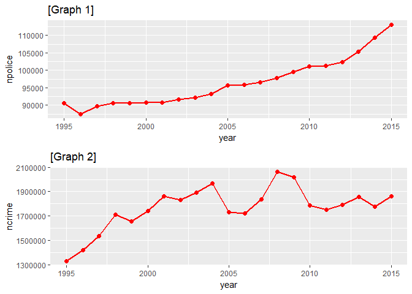

범죄 발생에 관한 연구
================

``` r
library(grid)
library(gridExtra)
library(dplyr)
library(ggplot2)
library(Rmisc)
data = read.csv('C:/r_proj/report/data_for_report/crime_data.csv')
data2 = read.csv('C:/r_proj/report/data_for_report/region_pop.csv')
```

### 범죄 발생에 관한 연구

-경찰력의 효율성을 중심으로-
============================

초록
====

이 연구의 목적은 '범죄율 하락에 실질적으로 기여하는 것은 무엇인가'에 대한 답을 찾는 것이다. 연구에 사용된 자료는 국가통계포털에 공개된 지역별 센서스 자료와 경찰청 통계연보 자료이다. 실증분석자료은 전국을 서울특별시 및 6개의 광역시, 그리고 전국 七道(제주도를 제외한)를 표본으로 1995~2015년 통계자료를 통합하여 구축됐다. 또한 통제된 지역별로 범죄발생 수, 하급 경찰서의 인력을 데이터로 사용했다. 이러한 데이터를 바탕으로, 서론에서 제시하게 될 ‘이례적 현상’이 일어나는 시점에서 횡단면 분석 및 시계열 분석을 시행했다. 서론에서는 매년 범죄의 수가 증가하는 추세를 제시하여 과연 경찰력의 물적 확대가 범죄율 경감에 기여하고 있는지에 대한 문제를 제기할 것이다. 본론에서는 특정 지역에서 연쇄살인사건이 발생한 뒤에 범죄자가 검거된 이후에도 범죄 발생지에 과한 경찰 인력 배치가 이뤄져 경찰 인력이 비효율적으로 사용되고 있음을 확인할 것이다. 그러한 경찰력에 의한 범죄의 예방 효과를 검증하고 인터넷 이용율의 증가가 범죄 예방에 어떠한 영향을 미치는지 논할 것이다.

1.  분석주제\[서론\]

우리는 어떤 범죄 또는 사고가 발생할 경우 정책 결정자들이 단순한 물적 확대, 예컨대 경찰관 숫자를 증가시키는 것으로 대처하는 것을 목격해왔다. 그러나 과연 이러한 대응이 궁극적으로 범죄율을 경감하는데 유효한지에 관해서는 의문이 제기될 수 있다. 경찰 투입 인력의 증가가 범죄율의 하락에 기여한다는 것은 자연스러운 추측이다. 그러나 실제로 데이터를 분석한 결과 지역별 경찰관 숫자와 범죄율 사이에는 양의 상관관계가 있었다(graph1&graph2). 그 이유로 크게 두 가지를 생각해 볼 수 있다. 첫째, 경찰인력이 효율적으로 사용되지 못했기 때문일 수 있다. 경찰력이 효율적으로 이용되지 못한다면 단순한 경찰력의 물적 확대는 범죄율 경감에 기여하지 못할 것이다. 두 번째 문제는 경찰관 숫자와 범죄율 사이의 내생성(endogeneity)이다. 예컨대 범죄의 증가가 단순한 트랜드이고, 경찰 인력의 증대가 범죄 증가에 따른 사후적 결과라면 위와 같은 결과가 나타날 수 있다. 이러한 이유로 단순한 통계자료만으로는 경찰 투입 인력이 범죄율 경감에 미치는 영향을 적절하게 평가하기는 어렵다. 그러나 본 연구에서는 2005년과 2010년에 전국적으로 나타나는 이례적 범죄율 하락을 목격할 수 있다. 특히 전 국민을 공포로 몰아넣었던 ‘김영철 연쇄살인 사건’과 ‘강호순 연쇄살인 사건’이 앞에서 언급한 범죄율 하락과 어떠한 연관이 있는지 관찰하여, 그러한 범죄율 하락에 실질적으로 작용한 요인이 무엇인지 분석할 것이다.

1.  분석 데이터 -데이터 소개 구축된 데이터는 통계청, 경찰청 통계연보에서 공개된 지역별 센서스 자료와 범죄 및 경찰인력 통계이다. 세부 내용으로는 지역별 1인당 순소비, 지역별 경찰인력 수, 지역별 범죄발생 수, 지역별 인터넷 이용률, 전국 범죄 발생률, 전국 경찰인력 수, 검거율이다. -데이터 선정 이유 지역별 소득 규모가 경찰 인력 배치에 영향을 주는지 알아보기 위해 1인당 순소비 데이터를 구축했다. 1인당 순소득이 아닌 순소비를 이용한 이유는 지역, 연도별 순소득 데이터가 존재하지 않았기 때문이다. 그러나 1인당 순소비는 1인당 순소득 자료를 대체하는 데 있어서 큰 무리가 없을 것으로 판단된다. 경찰인력과 범죄수를 지역별로 통제한 이유는 범죄가 지역별 문화적, 경제적 특성에 따라 영향을 받기 때문이다. 마지막으로 급증하는 SNS(social\_network\_system) 이용에 따라 범죄에 관한 경각심, 대중의 관심도가 높아지고 있다. 본 연구에서는 그러한 대중의 관심의 척도로서 '지역별 인터넷 이용률'데이터를 대리변수로 사용하였다.

2.  분석\[본론\] \[graph 1\]을 보면 2005년과 2010년에 범죄발생건수가 급격히 떨어지는 모습을 관찰할 수 있다.

``` r
p1=ggplot(data, aes(x= year,y=npolice)) + geom_line(col='red',size=1) + geom_point(col = 'red',size=2) +
  ggtitle('[Graph 1]')
p2=ggplot(data, aes(x= year, y= ncrime)) + geom_line(col='red',size=1) + geom_point(col = 'red',size=2) +
  ggtitle('[Graph 2]')

layout=matrix(c(1,1,2,2), nrow=2, byrow=TRUE)
multiplot(p1, p2, layout = layout)
```

 이러한 2005년과 2010년의 ‘이례적 범죄율 하락’에 주목한하면 경찰력 이외의 다른 변수가 범죄율 하락에 매우 큰 기여를 했을 가능성을 염두해볼 수 있다. 그러나 보다 정확한 분석을 위해서는 경찰인력과 범죄수를 지역별로 통제해줘야 한다. 그 이유는 경찰 인력의 배치는 전 지구적으로, 그리고 각 지역적 특성을 반영하여 이뤄지기 때문이다. 예컨대, 인구가 많은 서울 경기 지역에서는 범죄의 수와 경찰 인구의 절대량이 상대적으로 클 수밖에 없다. 따라서 위에서 언급했던 이례적인 하락 구간에서의 2004,2005년과 2009,2010년의 데이터를 사용하여 ‘지역별 인구/지역별 경찰관수 = 경찰 1인당 담당인구’, ‘지역별 범죄수/지역별 인구= 범죄발생비율’를 구해 비교해보았다.

``` r
p_capita_04<- data2$pop/data[10,36:50]
p_capita_05<- data2$pop/data[11,36:50]
diff0405 <- p_capita_05 - p_capita_04
diff0405 <- as.data.frame(diff0405)
diff0405 = t(diff0405)
df = data.frame(rownames(diff0405),diff0405)
colnames(df) = c('region','diff_capita0405')
rownames(df) = c(1:15)

p1= ggplot(df, aes(x=reorder(region,-diff_capita0405), y= diff_capita0405)) + geom_bar(stat= 'identity', fill='red') +
   ggtitle('[Graph3]') +
  theme(axis.text.x=element_text(angle=90, hjust=1),axis.title.x = element_blank())

p_capita_09<- data2$pop/data[15,36:50]
p_capita_10<- data2$pop/data[16,36:50]
diff0910 <- p_capita_10 - p_capita_09
diff0910 <- as.data.frame(diff0910)
diff0910 = t(diff0910)
df2 = data.frame(rownames(diff0910),diff0910)
colnames(df2) = c('region','diff_capita0910')
rownames(df2) = c(1:15)

p2=ggplot(df2, aes(x=reorder(region,-diff_capita0910), y= diff_capita0910)) + geom_bar(stat= 'identity', fill='red') +
  ggtitle('[Graph4]') +
  theme(axis.text.x=element_text(angle=90, hjust=1),axis.title.x = element_blank())

layout=matrix(c(1,1,2,2), nrow=2, byrow=TRUE)
multiplot(p1, p2, layout = layout)
```

 y축은 t년도에서 t-1년도의 1인당 담당인구를 빼준 1인당 담당인구의 변화량을 나타낸다. y의 값이 -(negative)가 됐다는 것은 과거에 비해 담당해야할 인구의 수가 줄었다는 것을 의미한다. 유영철이 검거된 해의 2004년과 2005년을 비교했을 때 인천 지역을 제외한 모든 지역에서는 1인당 담당인구가 줄어들었음을 확인할 수 있다. 반면 강호순이 검거된 해의 2009년과 2010년을 비교했을 때 경기 지역을 제외한 모든 지역의 1인당 담당인구가 증가했으며 그 수치 또한 상당하다.

``` r
p1=ggplot(data,aes(x= data$seoul_use, y= data$seoul_crime)) + geom_point(shape=1, col='red',size=3)#
p2=ggplot(data,aes(x= data$incheon_use, y= data$incheon_crime)) + geom_point(shape=1, col='red',size=3)
p3=ggplot(data,aes(x= data$kyungki_use, y= data$kyungki_crime)) + geom_point(shape=1, col='red',size=3)
p4=ggplot(data,aes(x= data$busan_use, y= data$busan_crime)) + geom_point(shape=1, col='red',size=3) #
p5=ggplot(data,aes(x= data$ulsan_use, y= data$ulsan_crime)) + geom_point(shape=1, col='red',size=3) #
p6=ggplot(data,aes(x= data$kangwon_use, y= data$kangwon_crime)) + geom_point(shape=1, col='red',size=3) #

vplayout <- function(x, y) viewport(layout.pos.row = x, layout.pos.col = y)

grid.newpage()
pushViewport(viewport(layout = grid.layout(2, 3)))
print(p1, vp = vplayout(1, 1))
print(p2, vp = vplayout(1, 2))
print(p3, vp = vplayout(1, 3))
print(p4, vp = vplayout(2, 1))
print(p5, vp = vplayout(2, 2))
print(p6, vp = vplayout(2, 3))
```


